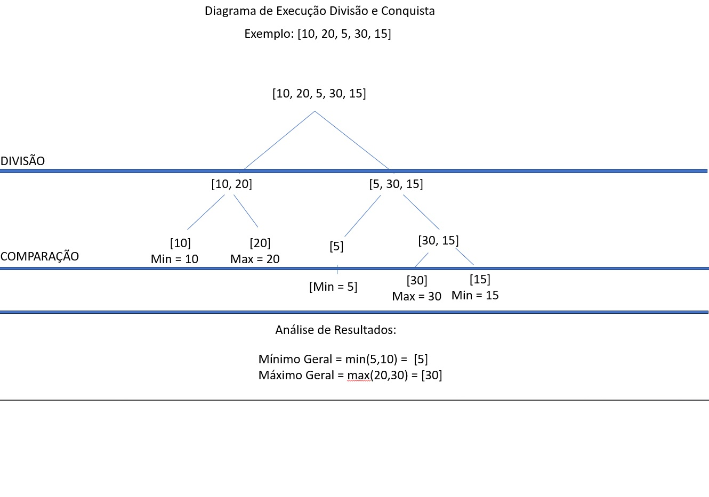

# Algoritmo MaxMin Select

## Descrição do Projeto
Este projeto implementa o **algoritmo MaxMin Select**, que encontra simultaneamente o **menor e o maior elemento** de um array utilizando **divisão e conquista**. 
O método reduz o número de comparações em relação à abordagem "padrão" e melhora a eficiência do processamento.

## Como Executar o Projeto

### Pré-requisitos
- Ter **Python 3.x** instalado.

###  Passos para execução
1. Clone o repositório:
   ```bash
   git clone https://github.com/nATHANnSil/FPAA-1.2025.git
   
E navegue até a pasta TrabalhoIndividual1 com:

   ``` 
   cd FPAA-1.2025/TrabalhoIndividual2
   ```

2. Execute o código
    ```
    python main.py

3. E siga as instruções do terminal:

   * **Insira os números um por um** e, quando terminar, digite **"PRONTO"**.

   * O programa exibirá o menor e o maior número encontrados.

   * Para continuar, pressione **Enter**. Para sair, digite **"PARE"**.

## Implementação do Algoritmo

O algoritmo **MaxMin Select** utiliza a abordagem de **divisão e conquista**:
1. **Divisão**: O array é dividido em duas metades recursivamente até que cada subproblema contenha 1 ou 2 elementos.
2. **Caso Base**:
   - Se o subproblema tem 1 elemento, ele é retornado como mínimo e máximo.
   - Se o subproblema tem 2 elementos, eles são comparados diretamente para determinar o mínimo e o máximo.
3. **Combinação**: Os resultados das duas metades são combinados para encontrar o mínimo e o máximo global.

**Exemplo**:
Para o array `[10, 20, 5, 30, 15]`:
- Divide em `[10, 20]` e `[5, 30, 15]`.
- Encontra o mínimo e máximo em cada metade:
  - `[10, 20]` → mínimo = 10, máximo = 20.
  - `[5, 30, 15]` → mínimo = 5, máximo = 30.
- Combina os resultados:
  - Mínimo global = min(10, 5) = 5.
  - Máximo global = max(20, 30) = 30.

### Análise da Complexidade

#### Contagem de Comparações
O algoritmo realiza:
- **1 comparação** para cada par de elementos no caso base.
- **2 comparações** para combinar os resultados das duas metades.
A recorrência é:
\[
C(n) = 2C(n/2) + 2
\]
Resolvendo a recorrência, obtemos:
\[
C(n) = \frac{3n}{2} - 2 \approx O(n)
\]

#### Aplicação do Teorema Mestre
A recorrência do algoritmo é:
\[
T(n) = 2T(n/2) + O(1)
\]
- **a = 2** (duas chamadas recursivas).
- **b = 2** (o problema é dividido pela metade).
- **f(n) = O(1)** (custo constante para combinar os resultados).

Calculando \( \log_b a = \log_2 2 = 1 \):
- Como \( f(n) = O(1) \) é menor que \( n^{\log_b a} = n^1 \), o algoritmo se enquadra no **Caso 1** do Teorema Mestre.
- Portanto, a complexidade é:
  \[
  T(n) = O(n^{\log_b a}) = O(n)
  \]

## Diagrama de Divisão e Conquista

A imagem abaixo mostra o diagrama de como o problema é dividido e como os resultados são combinados:

)

https://drive.google.com/file/d/1emaLp2C-oUJtDE2rF4SRyp6xdSm4tLkp/view?usp=sharing

- **Divisão**: O array é dividido recursivamente até atingir os casos base.
- **Comparação**: Os resultados das metades são combinados para encontrar o mínimo e o máximo global.

## Referências
- [Aula 01 - Análise de Complexidade de Algoritmos](https://github.com/joaopauloaramuni/fundamentos-de-projeto-e-analise-de-algoritmos/blob/main/PDF/AULA%2001_Ana%CC%81lise%20de%20complexidade%20de%20algoritmos.pdf)
- [Divisão e Conquista - GeeksforGeeks](https://www.geeksforgeeks.org/divide-and-conquer/)

## LICENÇA

Este projeto está licenciado sob a Licença MIT.


