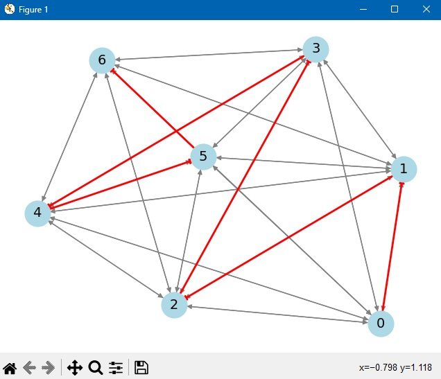
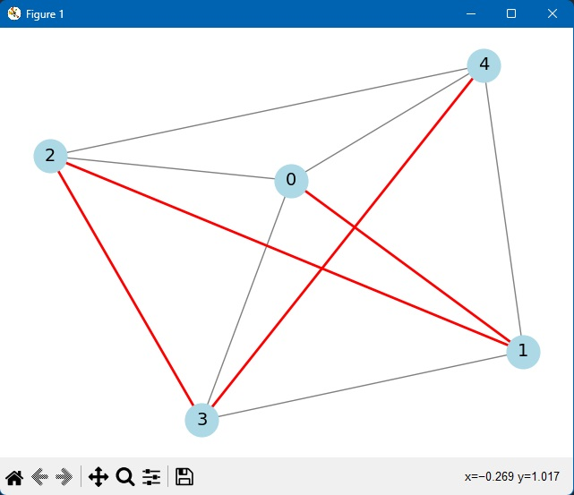

# Implementação do Algoritmo para Caminho Hamiltoniano

Este projeto implementa um algoritmo de backtracking para encontrar um **Caminho Hamiltoniano** em grafos direcionados ou não direcionados. Desenvolvido para a disciplina de Fundamentos de Projeto e Análise de Algoritmos da PUC Minas.

---

## Descrição do Projeto

### O que é um Caminho Hamiltoniano?
Um Caminho Hamiltoniano é um caminho em um grafo que visita cada vértice **exatamente uma vez**. Este problema é clássico na teoria da complexidade computacional e está classificado como **NP-Completo**, relacionando-se diretamente com problemas como o do Caixeiro Viajante (TSP).

### Funcionalidades do Algoritmo
- Suporta grafos **direcionados** e **não direcionados**.
- Gera grafos aleatórios com número de vértices e arestas configuráveis.
- Implementa backtracking para explorar todas as possíveis permutações de vértices.
- Inclui visualização do grafo e destaque do caminho encontrado (opcional).


### Estrutura do Código

- Da linha 1 a linha 4 ocorre a importação de bibliotecas necessárias para execução do código.
- Da linha 7 a linha 18, ocorre a inicialização do grafo com uma matriz de adjacência e gera arestas aleatórias.
- Da linha 20 a linha 118 são definidas as funções principais, e a execução do código é feita: 
   - Linha 20 a 28: Geração do grafo aleatório.
   - Linha 29 a 44: Lista todas as arestas, as embaralha e adiciona ao grafo.
   - Linha 46 a 52: Verificação se o vértice pode ser adicionado.
   - Linha 54 a 64: Execução do backtracking para encontrar o caminho Hamiltoniano.
   - Linha 68 a 75: Busca por Caminho Hamiltoniano, se existir.
   - Linha 77 a 98: Visualização e, caso exista caminho, o código o destaca.
   - Linha 100 a 118: Pergunta ao usuário se ele quer um grafo direcionado, ocorre a geração e processamento do grafo e sua exibição.

---

## Como Executar o Projeto

### Pré-requisitos
- Python 3.x
- Bibliotecas: `networkx`, `matplotlib` (para visualização)

### Instalação das Dependências
```bash
pip install networkx matplotlib
```

1. Clone o repositório:
   ```bash
   git clone https://github.com/nATHANnSil/FPAA-1.2025.git

   cd FPAA-1.2025/TrabalhoIndividual3

2. Execute o código: 
    ```
    python main.py

3. Siga as instruções do terminal:

- Escolha se o grafo será direcionado (`s`) ou não direcionado (`n`);

- O número de vértices (entre 5 e 8) e as arestas serão gerados automaticamente;

- O programa tentará encontrar um Caminho Hamiltoniano e exibirá a visualização do grafo.

## Exemplo de Saída:

```
Caminho Hamiltoniano encontrado (não direcionado): [0 → 1 → 2 → 3 → 4]
```
```
Caminho Hamiltoniano encontrado (não direcionado): [0 → 3 → 4 → 2 → 1]
```

### Visualização dos grafos:





Obs.: A cada execução, um novo grafo diferente será gerado.

# Relatório Técnico

## Análise da Complexidade Computacional

### Classes de Complexidade: P, NP, NP-Completo e NP-Difícil

1. **Classificação do Problema**:
   - **NP (Tempo Não Determinístico Polinomial)**:  
     O problema do Caminho Hamiltoniano pertence à classe **NP**, pois uma solução proposta pode ser verificada em tempo polinomial. Basta checar se o caminho visita todos os vértices exatamente uma vez e se as arestas existem no grafo.
   - **NP-Completo**:  
     O problema é **NP-Completo**, o que significa que:
     - Pertence a NP.
     - Todos os problemas em NP podem ser reduzidos a ele em tempo polinomial.  
     Isso é demonstrado pela redução do **Problema do Caixeiro Viajante (TSP)** ao Caminho Hamiltoniano. Enquanto o TSP busca um ciclo que minimize custos, o Caminho Hamiltoniano busca um caminho sem repetição, mantendo a essência da complexidade NP-Completo.
   - **NP-Difícil**:  
     Não se aplica diretamente, pois o problema não é necessariamente mais difícil que os NP-Completo, mas está contido nessa classe.

2. **Justificativa com Base no TSP**:  
   A redução do TSP para o Caminho Hamiltoniano preserva a complexidade. Se um algoritmo eficiente existisse para o Caminho Hamiltoniano, ele resolveria também o TSP, o que é improvável dada a conjectura P ≠ NP.

---

## Análise da Complexidade Assintótica de Tempo

1. **Complexidade Temporal**:
   - **Pior Caso**: \(O(V!)\), onde \(V\) é o número de vértices.  
   - **Caso Médio**: \(O(V!)\), pois mesmo em grafos densos, o algoritmo explora todas as permutações.  
   - **Melhor Caso**: \(O(1)\), se o caminho for encontrado na primeira tentativa (raro).  

2. **Método de Determinação**:  
   A complexidade foi calculada via **contagem de operações**. O algoritmo utiliza backtracking para testar todas as permutações possíveis de vértices, resultando em \(V!\) possibilidades. Para cada permutação, são realizadas \(O(V)\) operações de validação, levando a \(O(V \times V!)\).

---

## Aplicação do Teorema Mestre

1. **É possível aplicar o Teorema Mestre?**  
   **Não**, pois o Teorema Mestre é usado para resolver recorrências da forma \(T(n) = aT(n/b) + f(n)\), típicas de algoritmos de **divisão e conquista**.  

2. **Justificativa**:  
   O algoritmo de backtracking utilizado tem recorrência \(T(n) = n \cdot T(n-1) + O(n^2)\), que não se enquadra na estrutura do Teorema Mestre. A recorrência é fatorial, enquanto o Teorema Mestre lida com recorrências polinomiais ou logarítmicas.

---

## Análise dos Casos de Complexidade

| Caso         | Descrição                                                                 | Impacto no Desempenho                                                                 |
|--------------|---------------------------------------------------------------------------|---------------------------------------------------------------------------------------|
| **Pior Caso**| Grafos esparsos ou sem caminho Hamiltoniano.                             | Algoritmo explora todas as \(V!\) permutações, tornando-o impraticável para \(V > 15\).|
| **Caso Médio**| Grafos com densidade moderada de arestas.                                | Apesar da probabilidade maior de existir caminho, a complexidade permanece \(O(V!)\). |
| **Melhor Caso**| Grafos altamente conectados (ex.: completo) ou com caminho óbvio.        | Encontra a solução rapidamente, mas ainda depende da ordem de exploração.             |

### Impacto Prático
- **Grafos Pequenos (\(V \leq 10\))**: O algoritmo é viável.  
- **Grafos Grandes (\(V > 15\))**: Computacionalmente inviável devido ao crescimento fatorial.  
- **Conclusão**: A abordagem é adequada para fins educacionais, mas ineficiente em aplicações reais.

## Referências:

- [Aula 02 - Introdução à Teoria de Complexidades](https://github.com/joaopauloaramuni/fundamentos-de-projeto-e-analise-de-algoritmos/tree/main/PDF)

## Licença

Este projeto está licenciado sob a Licença MIT.
